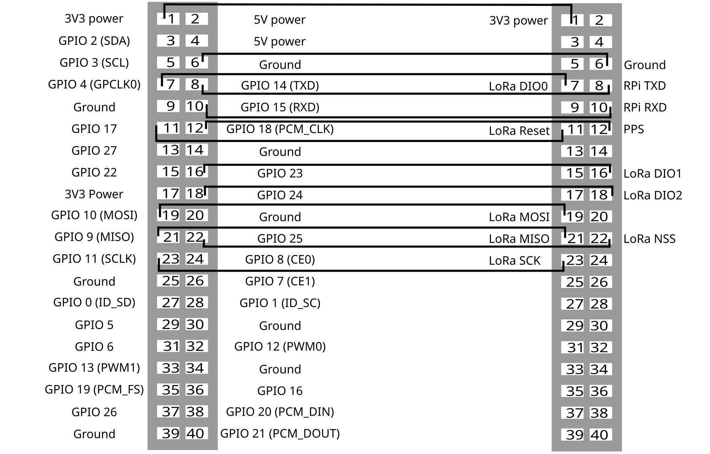

# basestation

The basestation consits of a RaspberryPi 3 Model B+, a connected display and a Dragino LoRa/GPS HAT.

The config.txt file in the boot folder was changed. The lines:

"
#restore uart on pin 14 & 15 

dtoverlay=disable-bt 

dtoverlay=spi0-2cs,cs1_pin=25
"

where added to change the pins vor the spi connection between the RaspberryPi and the Dragino Shield.

The basestation folder contains the code that runs on the raspberrypi. 

# board_config.py
In the board_config.py code the BCOM numbering of the GPIOs is set to the needed Pins for the Dragino Hat. If any other RaspberryPi is used it is neccessary to check whether the GPIOs match with the needed Pins of the Dragino Shield. Otherwise the numbers in board_config.py of the DIOs and RST need to be changed.

# basestation.py
basestation.py sniffes for transmissions and saves them into a database, this code should run continuously. If the code is restarted the database will be erased. If you want to keep the data you should make a copy before restarting the code.

# showdata.py
showdata.py generats the GUI and shows the data on the display of the rapsberrypi. The GUI is refreshed after restarting the code. 

# Pin connection
The picture shows how the GPIOs of the RaspberryPi 3 Model B+ and the Dragino are connected and therefore needed to be changed in the code. Left is RP and right is Dragino

